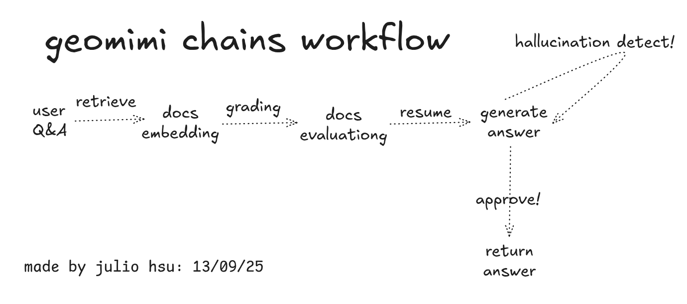

# 🌎 Geomimi – An Intelligent Assistent of Advanced Geography Hydrological Calculus

[](https://www.python.org/downloads/)
[](https://opensource.org/licenses/MIT)
[](https://streamlit.io/)
[](https://github.com/langchain-ai/langgraph)
[](https://python.langchain.com/)
[](https://www.trychroma.com/)
[](https://www.python.org/dev/peps/pep-0008/)

This is a BRAZILIAN - OPEN SOURCE of web application founded by "Julio Hsu" and its collaborators that allows you to ask questions about Brazil Geography and related content. It is built with LangGraph, Streamlit, and ChromaDB. If your document does not contain the answer, it automatically searches online to help you out.

This project demonstrates how to build a RAG (Retrieval-Augmented Generation) system using LangGraph for workflow management. LangGraph helps orchestrate the different steps in the RAG pipeline, from document processing to answer generation, with built-in error handling and state management.

If you're looking to understand how LangGraph works with RAG systems, this implementation shows practical patterns for building document question-answering applications with proper workflow orchestration.

## How It Works

*Demo Video Link of our app: https://www.loom.com/share/75cde0cc4820449bbf9580479d4fa1fb*

Here is what happens when you use this application and the process is actually quite straightforward:



*This diagram shows how everything works together behind the scenes.*

---

## LangGraph RAG Implementation

This project shows how to implement RAG with LangGraph in a practical way. LangGraph handles the workflow orchestration, managing the different steps like document retrieval, relevance checking, and answer generation.

### Why LangGraph for RAG?
- **State Management**: LangGraph manages the application state as it moves through different processing steps
- **Conditional Logic**: The workflow can decide whether to search documents or go online based on what it finds
- **Error Handling**: Built-in mechanisms to handle failures and try alternative approaches
- **Extensibility**: Easy to add new steps or modify the workflow as needed

### Key LangGraph RAG Patterns Used:
- Document evaluation before answer generation
- Conditional routing between different search methods
- Multi-step validation and quality checks
- State transitions with proper error recovery

If you want to learn LangGraph RAG implementation, this codebase provides a complete working example with real-world patterns.

---

## File Types We Support

You can upload these types of files:
- **Text Files**: `.txt`
- **PDF Documents**: `.pdf` 
- **Microsoft Word**: `.docx`
- **Excel Files**: `.csv`, `.xlsx`

---

## How It Works

The application works in a few simple steps, but there is complex processing happening behind the scenes:

1. **When You Ask a Question**:
   - You type your question in the text box
   - The app checks if your question makes sense
   - It searches through your uploaded documents to find relevant information
   - Multiple checks happen to make sure the answer will be good

2. **Getting Your Answer**:
   - The application looks at what it found in your documents
   - If there is relevant information, it writes an answer based on that
   - It performs quality checks to ensure the answer is not fabricated

3. **Ensuring Everything Works Properly**:
   - The application has several checkpoints to catch problems
   - It can identify when an answer might be incorrect or fabricated
   - If one method does not work, it tries another approach
   - You always know where your answer originated

4. **Evaluation and Transparency**:
   - After generating an answer, the system provides detailed evaluation metrics
   - Shows document relevance scores and which documents were most helpful
   - Displays question-answer matching quality and completeness ratings
   - Provides confidence levels and reasoning for each evaluation
   - Indicates whether online search was used or if answers came from your documents
   - All evaluation data is presented in easy-to-read tables for full transparency

5. **Seeing What's Happening** (Optional):
   - If you set up LangSmith, you can see exactly what the app is doing
   - Great for understanding the process or fixing issues
   - Shows you timing and performance info

### LangGraph RAG Architecture

The workflow uses LangGraph to manage the entire RAG pipeline:

- **State Management**: All data flows through a defined GraphState that tracks questions, documents, and evaluation results
- **Conditional Routing**: The system decides whether to use document search or online search based on what it finds
- **Error Recovery**: If document search fails, the workflow automatically tries online search
- **Multi-Step Validation**: Each step includes quality checks before moving to the next stage
- **Extensible Design**: Easy to add new evaluation steps or modify the workflow logic

This LangGraph RAG implementation provides a good foundation for building more complex document processing systems.

---

## What You'll Need

Before you start, make sure you have these things:

- **Python 3.11 or newer** - [Get it here](https://www.python.org/downloads/)
- **Git** - [Download here](https://git-scm.com/downloads) 
- **OpenAI API Key** - You need this to make the LLM work
- **LangSmith API Key** - Only if you want to see the workflow details (optional)

---

## Getting Started

### Step 1: Download the Code

```bash
git clone https://github.com/juliohsu/geomimi.git
cd geomimi
```

### Step 2: Set Up a Virtual Environment

This keeps everything organized and will not interfere with your other Python projects.

**If you are on Mac or Linux:**
```bash
python3 -m venv geomimi
source geomimi/bin/activate
```

**If you are on Windows:**
```bash
python -m venv geomimi
geomimi\Scripts\activate
```

### Step 3: Install Everything You Need

This installs all the required packages:

```bash
pip install --upgrade pip
pip install -r requirements.txt
```

### Step 4: Add Your API Keys

Create a file called `.env` in the main folder and add your API keys:

```env
OPENAI_API_KEY=your_openai_api_key_here
LANGCHAIN_API_KEY=your_langsmith_api_key_here
LANGCHAIN_TRACING_V2=true
LANGCHAIN_PROJECT=Advanced-RAG-LangGraph
```

### Step 5: Start the App

```bash
streamlit run app.py
```

Your browser will open automatically at `http://localhost:8501`

---

## Quick Start Guide

1. **Ask Away**: Type your question and hit "Ask"
2. **Get Your Answer**: You will see the answer (If the question is not related to the pdf, it wont return user desire answers)

## How to Use It

### The Basics

1. **Start the App**:
   ```bash
   streamlit run app.py
   ```
   Then go to `http://localhost:8501` in your browser

2. **Change the pdf and etc content**:
   - Look for the 'local_data'
   - Change you pdf or even others format files

3. **Ask Questions**:
   - Type your question in the text box
   - Click "Ask" or just press Enter
   - Check your answer

---

## License

This project uses the MIT License - check out the [LICENSE](LICENSE) file for the details.


